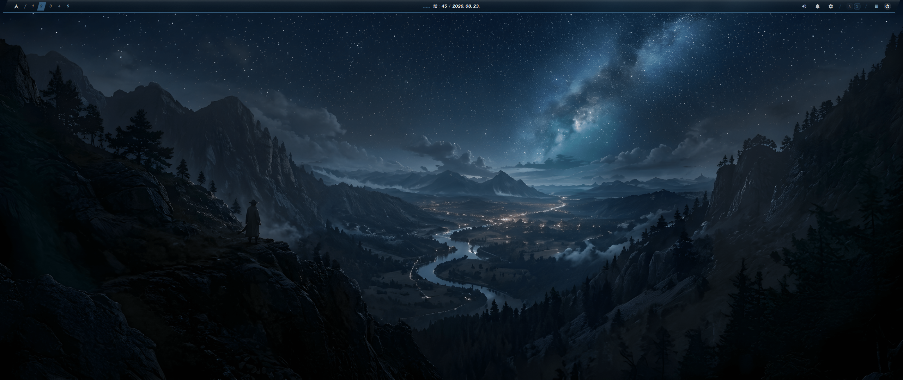
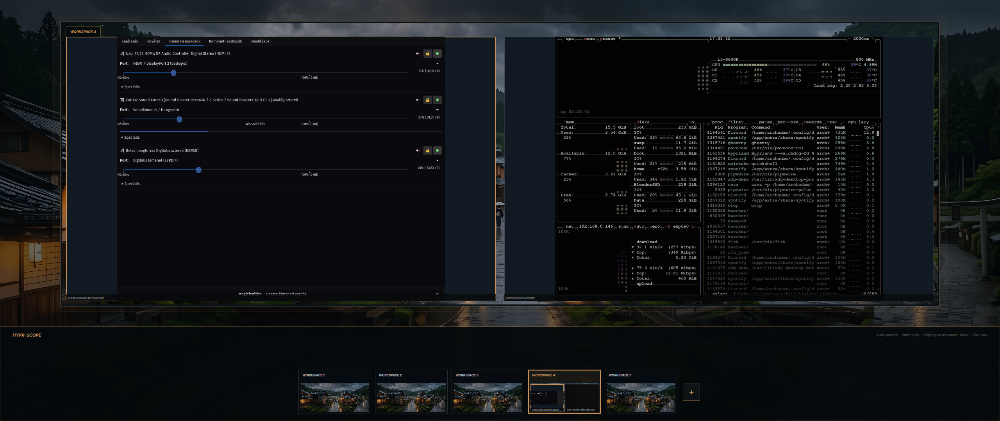
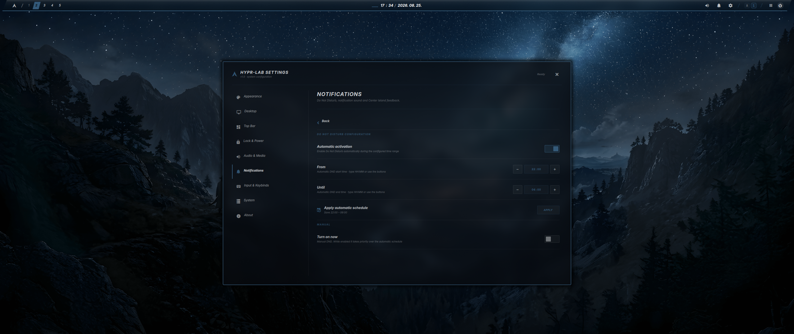
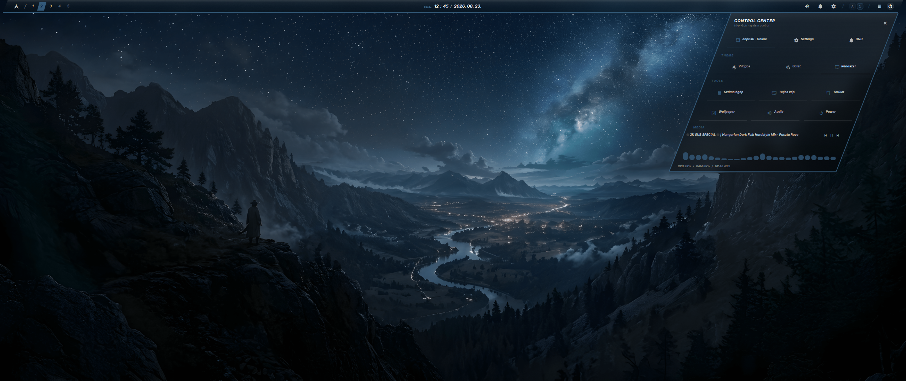
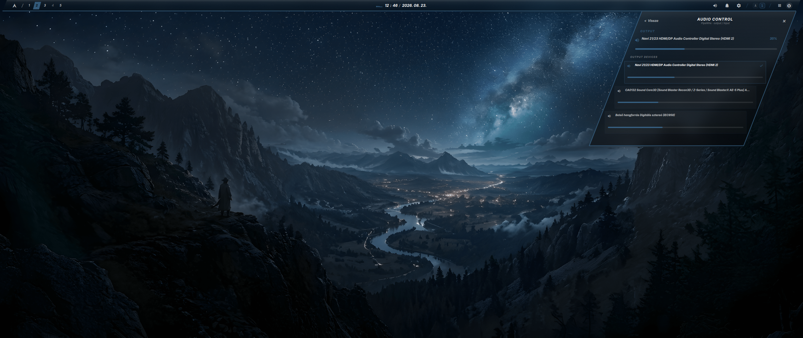
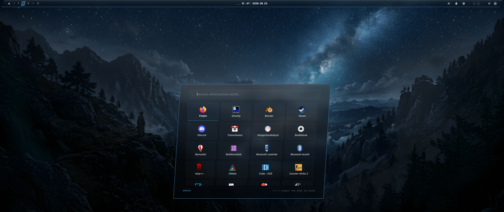
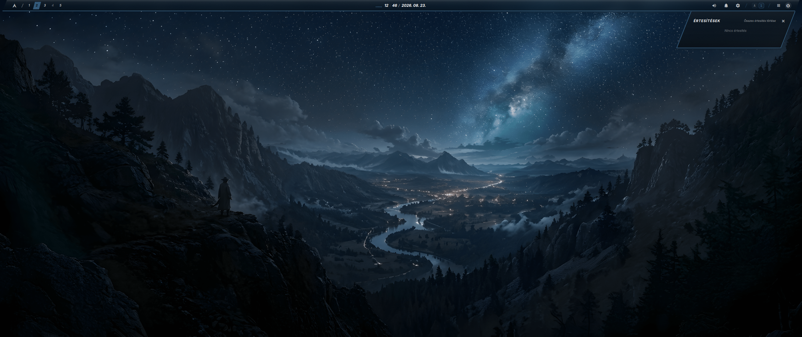
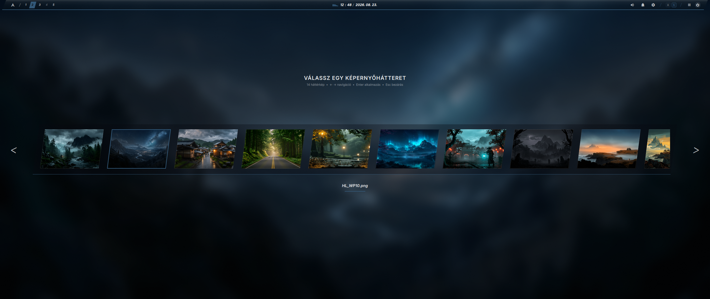
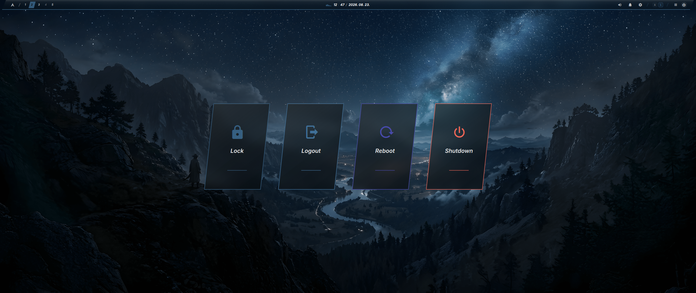

# Hypr-Lab 1.5

Hypr-Lab is the desktop setup I use on Arch Linux with Hyprland. Quickshell handles most of the shell itself: the Top Bar, launcher, settings, lock screen, control panels, wallpaper tools and the newer workspace features all live in the same setup.

A Hypr-Lab az a desktop setup, amit Arch Linuxon és Hyprlanden használok. A shell nagy részét a Quickshell kezeli: ide tartozik a Top Bar, a launcher, a Settings, a lock screen, a vezérlőpanelek, a háttérképkezelés és az új workspace funkciók is.



---

## Hypr-Lab 1.5 — development branch / fejlesztői ág

**Hypr-Lab 1.0 is still the current stable release.** Work on 1.5 happens on the `develop-v1.5` branch.

**A Hypr-Lab 1.0 továbbra is a stabil kiadás.** Az 1.5 fejlesztése a `develop-v1.5` ágon zajlik.

**Current milestone / Jelenlegi mérföldkő: v1.5 RC4**

RC4 adds the first complete version of **Hypr-Scope**, along with a more capable Do Not Disturb setup. The rest of the 1.5 shell is already in daily-use shape, but this branch is still under development and can change before the final release.

Az RC4-ben elkészült a **Hypr-Scope** első teljesen használható változata, és a Ne zavarjanak mód is jóval többet tud. Az 1.5 többi része már napi használatban is működik, de ez továbbra is fejlesztői ág, ezért a végleges kiadásig még változhat.

---

## What is in 1.5? / Mi van az 1.5-ben?

### English

The 1.5 branch is a fairly big rebuild. At the moment it includes:

- a unified Hypr-Lab Top Bar with workspaces, Center Island and system controls;
- workspace count configurable from 1 to 10, with navigation limited to the enabled workspaces;
- **Hypr-Scope**, opened with `SUPER + SHIFT + D`, for visual workspace switching and moving windows between workspaces with drag & drop;
- workspace creation and removal directly from Hypr-Scope;
- configurable Top Bar modules and Center Island feedback;
- wallpaper-adaptive accent colors;
- a 4×4 App Launcher with search, mouse control and keyboard navigation;
- Control Center with theme, tools, media and system actions;
- separate Audio Control with output-device selection and volume controls;
- Notification Center with manual Do Not Disturb control;
- scheduled Do Not Disturb configuration in Hypr-Lab Settings, including editable start/end times and manual override;
- a `Zz` indicator next to the clock/date whenever DND is active;
- USB Manager with mount, unmount and safe eject actions;
- animated Wallpaper Manager and horizontal Wallpaper Picker;
- custom Lock Screen with media/CAVA dock;
- automatic lock, display standby and suspend handling;
- Hypr-Lab Settings for appearance, desktop, Top Bar, lock/power, notifications and other shell options;
- monitor configuration tools;
- screenshot shortcuts;
- custom Hypr-Lab cursor and Fluent teal icon theme;
- installer backups and a matching uninstaller.

### Magyar

Az 1.5 jóval több egy kisebb frissítésnél. Jelenleg ezek a főbb részek működnek benne:

- egységes Hypr-Lab Top Bar workspace-ekkel, Center Islanddel és rendszervezérlőkkel;
- 1 és 10 között állítható workspace-mennyiség, a navigáció pedig csak a ténylegesen engedélyezett workspace-ekre működik;
- **Hypr-Scope** `SUPER + SHIFT + D` gyorsbillentyűvel, vizuális workspace-váltással és drag & drop ablakmozgatással;
- workspace-ek létrehozása és bezárása közvetlenül a Hypr-Scope felületéről;
- külön kapcsolható Top Bar modulok és Center Island visszajelzések;
- a háttérképhez automatikusan igazodó accent szín;
- 4×4-es App Launcher kereséssel, egér- és billentyűzetes vezérléssel;
- Control Center téma-, eszköz-, média- és rendszerműveletekkel;
- külön Audio Control hangkimenet-választással és hangerőszabályzással;
- Notification Center manuális Ne zavarjanak kapcsolóval;
- időzíthető Ne zavarjanak mód a Hypr-Lab Settingsben, szabadon beállítható kezdő- és záróidővel, valamint manuális felülbírálással;
- `Zz` visszajelzés az óra/dátum mellett, amikor a DND aktív;
- USB Manager mount, unmount és biztonságos leválasztási funkciókkal;
- animált Wallpaper Manager és vízszintes Wallpaper Picker;
- saját Lock Screen media/CAVA dockkal;
- automatikus képernyőzár, kijelző-készenlét és rendszer-altatás;
- Hypr-Lab Settings appearance, desktop, Top Bar, lock/power, notification és további shell beállításokkal;
- monitorkonfigurációs eszközök;
- screenshot gyorsbillentyűk;
- saját Hypr-Lab kurzor és Fluent teal ikontéma;
- telepítés előtti backup és hozzá tartozó uninstaller.

---

## Screenshots / Képernyőképek

### Desktop


### Hypr-Scope



### Hypr-Lab Settings — DND schedule



### Hypr-Lab Settings


### Control Center



### Audio Control



### App Launcher



### Notification Center



### Wallpaper Picker



### Power Menu



---

## Requirements / Követelmények

Hypr-Lab currently targets:

- Arch Linux;
- Hyprland 0.55+ using the Lua configuration model;
- Wayland;
- Quickshell;
- PipeWire + WirePlumber.

A Hypr-Lab jelenlegi célrendszere:

- Arch Linux;
- Hyprland 0.55+ Lua konfigurációs modellel;
- Wayland;
- Quickshell;
- PipeWire + WirePlumber.

The installer checks the Arch packages it needs and can install anything that is missing.

A telepítő ellenőrzi a szükséges Arch csomagokat, és igény esetén felrakja azt, ami hiányzik.

---

# Quick Install / Gyors telepítés

## English

Clone the repository and run the installer as your **normal user**:

```bash
git clone https://github.com/hu-nadam0607/Hypr-Lab.git
cd Hypr-Lab
./install.sh
```

Do **not** run `install.sh` as root. It asks for `sudo` only when it actually needs to change something system-wide.

Once the installer is done, reboot. On a clean Arch installation the normal login path is:

```text
greetd -> tuigreet -> start-hyprland -> Hyprland -> Hypr-Lab
```

If you skipped login-manager setup, you can also start Hyprland from a TTY:

```bash
start-hyprland
```

## Magyar

Klónozd a repositoryt, majd **normál felhasználóként** indítsd el a telepítőt:

```bash
git clone https://github.com/hu-nadam0607/Hypr-Lab.git
cd Hypr-Lab
./install.sh
```

Az `install.sh` fájlt **ne rootként** futtasd. Csak akkor kér `sudo` jogosultságot, amikor tényleg rendszerszintű módosításra van szükség.

A telepítés végén indítsd újra a gépet. Tiszta Arch telepítésnél az alapértelmezett bejelentkezési útvonal:

```text
greetd -> tuigreet -> start-hyprland -> Hyprland -> Hypr-Lab
```

Ha kihagytad a login manager beállítását, Hyprland TTY-ből is indítható:

```bash
start-hyprland
```

---

# Quick Uninstall / Gyors eltávolítás

## English

From the cloned Hypr-Lab directory run:

```bash
./uninstall.sh
```

By default the uninstaller removes the Hypr-Lab user configuration, restores the pre-install backup when one exists, removes Hypr-Lab-owned themes and restores the login integration managed by Hypr-Lab. Arch packages stay installed unless you explicitly approve their removal. The cloned repository itself is left alone.

Full purge:

```bash
./uninstall.sh --purge
```

Non-interactive full purge:

```bash
./uninstall.sh --purge --yes
```

## Magyar

A klónozott Hypr-Lab könyvtárban futtasd:

```bash
./uninstall.sh
```

Alapértelmezetten az uninstaller eltávolítja a Hypr-Lab felhasználói konfigurációját, visszaállítja a telepítés előtti backupot, ha van ilyen, eltávolítja a Hypr-Labhoz tartozó témákat, és visszaállítja a Hypr-Lab által kezelt login integrációt. Az Arch csomagok megmaradnak, hacsak külön nem hagyod jóvá az eltávolításukat. A klónozott repositoryt nem törli.

Teljes eltávolítás:

```bash
./uninstall.sh --purge
```

Nem interaktív teljes eltávolítás:

```bash
./uninstall.sh --purge --yes
```

---

## Package handling / Csomagkezelés

The installer keeps track of packages that were missing before Hypr-Lab and were installed by the installer. The uninstaller only offers those recorded packages for removal. Anything that was already installed before Hypr-Lab is left alone. Package removal itself is done with `pacman -Rns`, including its normal dependency checks.

A telepítő feljegyzi azokat a csomagokat, amelyek a Hypr-Lab előtt nem voltak fent, és amelyeket maga a telepítő rakott fel. Az uninstaller csak ezeket ajánlja fel eltávolításra. Ami már korábban is telepítve volt, ahhoz nem nyúl. A tényleges eltávolítást a `pacman -Rns` végzi a szokásos függőségellenőrzéssel.

---

## Installer options / Telepítő opciók

```text
-y, --yes            Accept normal prompts automatically
                     Normál kérdések automatikus elfogadása

--skip-deps          Skip Arch package installation/checks
                     Arch csomagok ellenőrzésének/telepítésének kihagyása

--no-gtk             Do not install Hypr-Lab GTK CSS
                     Hypr-Lab GTK CSS telepítésének kihagyása

--no-themes          Do not install the Hypr-Lab cursor and Fluent icons
                     Hypr-Lab kurzor és Fluent ikonok telepítésének kihagyása

--no-login-manager   Do not configure greetd/tuigreet
                     A greetd/tuigreet konfigurálásának kihagyása

-h, --help           Show help / Súgó
```

## Uninstaller options / Eltávolító opciók

```text
-y, --yes       Accept safe default prompts automatically
                Biztonságos alapértelmezett válaszok automatikus elfogadása

--purge         Remove tracked packages and Hypr-Lab state/backups too
                Rögzített csomagok és a Hypr-Lab state/backup eltávolítása

--purge-deps    Remove packages recorded as installed by Hypr-Lab
                A Hypr-Lab által telepítettként rögzített csomagok eltávolítása

--purge-state   Remove ~/.local/state/hypr-lab after uninstall
                A ~/.local/state/hypr-lab eltávolítása az uninstall után

--no-restore    Do not restore the pre-Hypr-Lab configuration backup
                Ne állítsa vissza a Hypr-Lab előtti konfigurációt

--keep-login    Leave greetd/display-manager integration untouched
                A greetd/display-manager integráció érintetlenül hagyása

-h, --help      Show help / Súgó
```

---

## Default themes / Alapértelmezett témák

### Cursor / Kurzor

Hypr-Lab builds its Bibata-based cursor locally during installation:

A Hypr-Lab telepítés közben helyben építi fel a Bibata-alapú kurzort:

```text
Bibata-Modern-Hypr-Lab
size / méret: 24
inside / belső szín: black / fekete
outline / körvonal: #37F5EB
```

The cursor is built from the upstream Bibata Modern SVG sources. Licensing details are in `THIRD_PARTY_NOTICES.md`.

A kurzor az upstream Bibata Modern SVG forrásaira épül. A licencinformációk a `THIRD_PARTY_NOTICES.md` fájlban vannak.

### Icons / Ikonok

The installer uses the upstream Fluent icon theme and selects:

A telepítő az upstream Fluent ikontémát használja, alapértelmezetten ezzel a változattal:

```text
Fluent-teal-dark
```

The icon theme remains a separate upstream project. See `THIRD_PARTY_NOTICES.md` for details.

Az ikontéma továbbra is külön upstream projekt. A részletek a `THIRD_PARTY_NOTICES.md` fájlban vannak.

---

## Main dependencies / Fő függőségek

The desktop stack uses official Arch packages where possible. The main pieces are Hyprland, Quickshell, Ghostty, PipeWire, WirePlumber, Hypridle, Hyprpolkitagent, XDG portals, screenshot/media tools, fonts, `greetd` and `greetd-tuigreet`.

A desktop stack lehetőség szerint hivatalos Arch csomagokra épül. A fő elemek: Hyprland, Quickshell, Ghostty, PipeWire, WirePlumber, Hypridle, Hyprpolkitagent, XDG portalok, screenshot- és médiaeszközök, betűtípusok, `greetd` és `greetd-tuigreet`.

Hypr-Lab does not force a specific browser or file manager. Browser launching follows the XDG default, and supported installed file managers are detected automatically.

A Hypr-Lab nem erőltet rád konkrét böngészőt vagy fájlkezelőt. A böngésző az XDG alapértelmezést követi, a támogatott telepített fájlkezelőket pedig automatikusan felismeri.

Theme installation also uses Git, Yarn/npm and pipx to build the Hypr-Lab Bibata variant from upstream source.

A témák telepítéséhez Git, Yarn/npm és pipx is szükséges, mert a Hypr-Lab Bibata változata upstream forrásból épül.

---

## Main shortcuts / Fő gyorsbillentyűk

| Shortcut / Gyorsbillentyű | Action / Művelet |
| --- | --- |
| `SUPER + SPACE` | App Launcher / Alkalmazásindító |
| `SUPER + SHIFT + C` | Control Center / Vezérlőközpont |
| `SUPER + SHIFT + V` | Audio Control / Hangvezérlés |
| `SUPER + SHIFT + N` | Notification Center / Értesítési központ |
| `SUPER + SHIFT + D` | Hypr-Scope |
| `SUPER + SHIFT + W` | Wallpaper Picker / Háttérképválasztó |
| `SUPER + W` | Random wallpaper / Véletlenszerű háttérkép |
| `SUPER + I` | Hypr-Lab Settings / Beállítások |
| `SUPER + L` | Lock Screen / Képernyőzár |
| `SUPER + ALT + W` | Welcome Screen / Üdvözlőképernyő |
| `SUPER + SHIFT + P` | Power Menu / Kikapcsolási menü |
| `SUPER + C` | Ghostty |
| `SUPER + E` | Selected/detected file manager / Kiválasztott vagy felismert fájlkezelő |
| `SUPER + B` | XDG default browser / XDG alapértelmezett böngésző |
| `SUPER + M` | Exit Hyprland session / Kilépés a Hyprland munkamenetből |
| `SUPER + 1…0` | Workspace 1…10, limited by Settings / Workspace 1…10, a Settingsben megadott limit szerint |

DND is still available manually from Control Center. Its automatic schedule and manual override are configured from **Hypr-Lab Settings → Notifications**.

A DND továbbra is kapcsolható kézzel a Control Centerből. Az automatikus időzítés és a manuális felülbírálás a **Hypr-Lab Settings → Notifications** oldalon állítható.

---

## Backups / Biztonsági mentések

Before replacing an existing Hypr-Lab-related user configuration, the installer creates a backup when needed:

A meglévő, Hypr-Lab által érintett felhasználói konfiguráció cseréje előtt a telepítő szükség esetén backupot készít:

```text
~/.local/state/hypr-lab/backups/<timestamp>/
```

The latest backup path is stored in:

A legutóbbi backup helyét ez a fájl tárolja:

```text
~/.local/state/hypr-lab/last-backup
```

The uninstaller uses this when it needs to restore the configuration that existed before Hypr-Lab.

Az uninstaller ezt használja, amikor vissza kell állítania a Hypr-Lab előtti konfigurációt.

---

## Repository layout / Repository felépítése

```text
Hypr-Lab/
├── config/
│   ├── hypr/
│   ├── quickshell/
│   ├── gtk-3.0/
│   ├── gtk-4.0/
│   └── wireplumber/
├── docs/
│   └── screenshots/
├── system/
│   └── greetd/
│       └── config.toml
├── install.sh
├── uninstall.sh
├── verify-release.sh
├── manifest.json
├── README.md
├── RELEASE_NOTES.md
├── THIRD_PARTY_NOTICES.md
└── LICENSE
```

`config/` contains the user configuration installed by Hypr-Lab. `system/` contains the system-level templates used when needed. Screenshots live in `docs/screenshots/`. The installer, uninstaller, release metadata and licensing files stay in the repository root.

A `config/` tartalmazza a Hypr-Lab által telepített felhasználói konfigurációt. A `system/` alatt vannak a szükség esetén használt rendszerszintű sablonok. A képernyőképek a `docs/screenshots/` könyvtárban vannak. A telepítő, az uninstaller, a release metaadatok és a licencfájlok a repository gyökerében maradnak.

---

## License and credits / Licenc és közreműködők

Hypr-Lab is released under the **GNU General Public License v3.0** and is maintained by **nadam0607**. Third-party components keep their own copyright and licensing terms; details are in `THIRD_PARTY_NOTICES.md`.

A Hypr-Lab a **GNU General Public License v3.0** alatt jelenik meg, karbantartója **nadam0607**. A harmadik féltől származó komponensek megtartják a saját szerzői jogi és licencfeltételeiket; a részletek a `THIRD_PARTY_NOTICES.md` fájlban találhatók.
