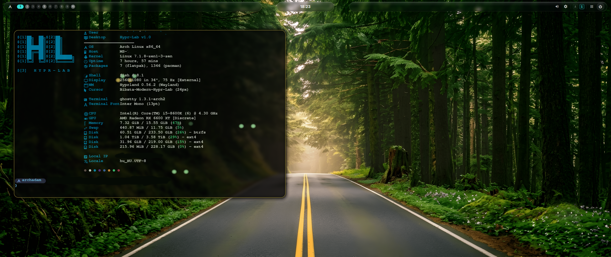
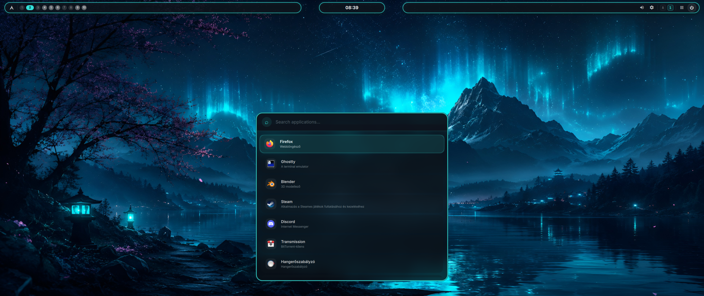

# Hypr-Lab 1.0

**Hypr-Lab** is a Quickshell-based desktop environment-style shell for Arch Linux and modern Hyprland Lua configurations.

**Hypr-Lab** egy Quickshell-alapú, desktop environment jellegű felhasználói környezet Arch Linuxhoz és a modern Hyprland Lua konfigurációs rendszeréhez.


---

## 🚧 Hypr-Lab 1.5 — Active Development / Aktív fejlesztés

> **Hypr-Lab 1.0 is the current stable release.**
>
> Development of **Hypr-Lab 1.5** is actively underway on the `develop-v1.5` branch.
>
> **Current development milestone: v1.5 Beta 2**

### v1.5 Beta 2 Preview



### What's coming in 1.5

* native Frosted Glass 3D design;
* adaptive window borders that automatically derive their accent color from the current wallpaper;
* reduced wallpaper memory usage;
* cleaner and more maintainable Quickshell sources;
* cleaned-up Hyprland Lua configuration and helper scripts;
* continued visual and performance refinements.

### Mi érkezik az 1.5-ben

* natív Frosted Glass 3D megjelenés;
* a jelenlegi háttérkép színvilágához automatikusan alkalmazkodó ablakkeretek;
* csökkentett memóriahasználat a háttérképkezelésben;
* tisztább és könnyebben karbantartható Quickshell forrás;
* megtisztított Hyprland Lua konfiguráció és helper scriptek;
* további vizuális és teljesítménybeli finomítások.

> The `develop-v1.5` branch is a development branch and may contain unfinished or experimental changes.
>
> A `develop-v1.5` fejlesztői ág, ezért befejezetlen vagy kísérleti módosításokat is tartalmazhat.

---

## Features / Funkciók

### English

Hypr-Lab provides an integrated desktop experience built around Hyprland and Quickshell.

Main features include:

* custom Hypr-Lab Top Bar with workspaces, Center Island and system controls;
* App Launcher with search and keyboard navigation;
* Control Center;
* advanced audio control and output-device selection;
* media controls and visualization;
* Notification Center;
* Do Not Disturb mode;
* USB Manager;
* Wallpaper Manager with animated transitions;
* wallpaper picker;
* custom Lock Screen;
* Welcome Screen;
* Power Menu;
* Hypr-Lab Settings;
* monitor configuration tools;
* custom Hypr-Lab cursor;
* Fluent teal icon theme;
* integrated screenshot shortcuts;
* automatic backup and safe uninstall support.

### Magyar

A Hypr-Lab egy Hyprlandre és Quickshellre épülő, egységes asztali környezetet biztosít.

Főbb funkciói:

* egyedi Hypr-Lab felső sáv munkaterületekkel, Center Islanddel és rendszervezérlőkkel;
* keresést és billentyűzetes navigációt támogató App Launcher;
* Control Center;
* fejlett hangerőszabályzás és hangkimenet-választás;
* médiavezérlés és vizualizáció;
* Notification Center;
* Ne zavarjanak mód;
* USB Manager;
* animált átmeneteket használó Wallpaper Manager;
* háttérképválasztó;
* egyedi Lock Screen;
* Welcome Screen;
* Power Menu;
* Hypr-Lab Settings;
* monitorkonfigurációs eszközök;
* egyedi Hypr-Lab kurzor;
* Fluent teal ikontéma;
* integrált képernyőkép-gyorsbillentyűk;
* automatikus biztonsági mentés és biztonságos eltávolítás.

---

## Hypr-Lab in action / Hypr-Lab működés közben

### App Launcher



### Control Center


### Notification Center


### Wallpaper Picker


### Lock Screen


---

## Requirements / Követelmények

### English

Hypr-Lab targets:

* Arch Linux;
* Hyprland 0.55+ using the Lua configuration model;
* Wayland;
* PipeWire + WirePlumber;
* Quickshell.

The installer can install the required Arch Linux packages that are missing from the system.

### Magyar

A Hypr-Lab célrendszere:

* Arch Linux;
* Hyprland 0.55+ Lua konfigurációs modellel;
* Wayland;
* PipeWire + WirePlumber;
* Quickshell.

A telepítő képes telepíteni a rendszerből hiányzó szükséges Arch Linux csomagokat.

---

# Quick Install / Gyors telepítés

## English

Clone the official Hypr-Lab repository:

```bash
git clone https://github.com/hu-nadam0607/Hypr-Lab.git
cd Hypr-Lab
./install.sh
```

Run the installer as your **normal user**.

Do **not** run `install.sh` as root. The installer requests `sudo` only when system-level changes are required.

Follow the interactive installer and reboot the computer when installation is complete.

On a clean Arch Linux installation, the normal login path is:

```text
greetd -> tuigreet -> start-hyprland -> Hyprland -> Hypr-Lab
```

If login-manager configuration was intentionally skipped, Hyprland can be started from a TTY with:

```bash
start-hyprland
```

## Magyar

Klónozd a hivatalos Hypr-Lab repositoryt:

```bash
git clone https://github.com/hu-nadam0607/Hypr-Lab.git
cd Hypr-Lab
./install.sh
```

A telepítőt **normál felhasználóként** indítsd el.

Az `install.sh` fájlt **ne futtasd root felhasználóként**. A telepítő csak azoknál a műveleteknél kér `sudo` jogosultságot, amelyek rendszerszintű módosítást igényelnek.

Kövesd az interaktív telepítő utasításait, majd a telepítés befejezése után indítsd újra a számítógépet.

Tiszta Arch Linux telepítésen az alapértelmezett bejelentkezési folyamat:

```text
greetd -> tuigreet -> start-hyprland -> Hyprland -> Hypr-Lab
```

Ha a login manager konfigurálását szándékosan kihagytad, a Hyprland TTY-ből is elindítható:

```bash
start-hyprland
```

---

# Quick Uninstall / Gyors eltávolítás

## English

Enter the cloned Hypr-Lab directory and run:

```bash
./uninstall.sh
```

The default uninstall process:

* removes Hypr-Lab user configuration;
* restores the pre-Hypr-Lab configuration backup when available;
* removes themes owned by Hypr-Lab;
* restores Hypr-Lab-managed login integration;
* keeps Arch Linux packages unless you explicitly approve their removal;
* leaves the cloned Hypr-Lab repository itself untouched.

For a full uninstall using the package ownership information recorded by the installer:

```bash
./uninstall.sh --purge
```

For a non-interactive full purge:

```bash
./uninstall.sh --purge --yes
```

## Magyar

Lépj be a klónozott Hypr-Lab könyvtárba, majd futtasd:

```bash
./uninstall.sh
```

Az alapértelmezett eltávolítás:

* eltávolítja a Hypr-Lab felhasználói konfigurációját;
* visszaállítja a Hypr-Lab előtti konfiguráció biztonsági mentését, ha rendelkezésre áll;
* eltávolítja a Hypr-Lab tulajdonában lévő témákat;
* visszaállítja a Hypr-Lab által kezelt bejelentkezési integrációt;
* megtartja az Arch Linux csomagokat, hacsak azok eltávolítását külön nem hagyod jóvá;
* magát a klónozott Hypr-Lab repositoryt érintetlenül hagyja.

A telepítő által rögzített csomagtulajdonosi információkat használó teljes eltávolításhoz:

```bash
./uninstall.sh --purge
```

Nem interaktív teljes eltávolításhoz:

```bash
./uninstall.sh --purge --yes
```

---

## Safe package handling / Biztonságos csomagkezelés

### English

Hypr-Lab does **not guess which packages it owns**.

During installation, packages that were missing before Hypr-Lab and were installed by the installer are recorded.

During uninstall, only these recorded packages can be offered for removal.

Packages that were already installed before Hypr-Lab are not recorded as Hypr-Lab-owned and are therefore not removed by the uninstaller.

When package removal is requested, `pacman -Rns` performs its normal dependency resolution and safety checks.

### Magyar

A Hypr-Lab **nem próbálja kitalálni, hogy mely csomagok tartoznak hozzá**.

Telepítés közben a telepítő rögzíti azokat a csomagokat, amelyek a Hypr-Lab telepítése előtt hiányoztak, és amelyeket maga a telepítő telepített.

Eltávolításkor kizárólag ezek a rögzített csomagok ajánlhatók fel eltávolításra.

A Hypr-Lab telepítése előtt már meglévő csomagokat a telepítő nem jelöli Hypr-Lab-tulajdonként, ezért az uninstaller sem távolítja el őket.

Csomageltávolítás esetén a `pacman -Rns` végzi a szokásos függőségfeloldást és biztonsági ellenőrzéseket.

---

## Installer options / Telepítő opciók

```text
-y, --yes            Accept normal prompts automatically
                     Normál kérdések automatikus elfogadása

--skip-deps          Skip Arch package installation/checks
                     Arch csomagok ellenőrzésének/telepítésének kihagyása

--no-gtk             Do not install Hypr-Lab GTK CSS
                     Hypr-Lab GTK CSS telepítésének kihagyása

--no-themes          Do not install the Hypr-Lab cursor and Fluent icons
                     Hypr-Lab kurzor és Fluent ikonok telepítésének kihagyása

--no-login-manager   Do not configure greetd/tuigreet
                     A greetd/tuigreet konfigurálásának kihagyása

-h, --help           Show help
                     Súgó megjelenítése
```

---

## Uninstaller options / Eltávolító opciók

```text
-y, --yes       Accept safe default prompts automatically
                Biztonságos alapértelmezett válaszok automatikus elfogadása

--purge         Remove tracked packages and Hypr-Lab state/backups too
                Rögzített csomagok és a Hypr-Lab state/backup eltávolítása

--purge-deps    Remove packages recorded as installed by Hypr-Lab
                A Hypr-Lab által telepítettként rögzített csomagok eltávolítása

--purge-state   Remove ~/.local/state/hypr-lab after uninstall
                A ~/.local/state/hypr-lab eltávolítása az uninstall után

--no-restore    Do not restore the pre-Hypr-Lab configuration backup
                Ne állítsa vissza a Hypr-Lab előtti konfigurációt

--keep-login    Leave greetd/display-manager integration untouched
                A greetd/display-manager integráció érintetlenül hagyása

-h, --help      Show help
                Súgó megjelenítése
```

---

## Default visual themes / Alapértelmezett vizuális témák

### Cursor / Kurzor

### English

Hypr-Lab builds its custom Bibata cursor locally during installation:

```text
Bibata-Modern-Hypr-Lab
size: 24
inside: black
outline: #37F5EB
```

The build uses the upstream Bibata Modern SVG sources.

The upstream project is not authored by Hypr-Lab. See `THIRD_PARTY_NOTICES.md`.

### Magyar

A Hypr-Lab a telepítés során helyben építi fel az egyedi Bibata kurzort:

```text
Bibata-Modern-Hypr-Lab
méret: 24
belső szín: fekete
körvonal: #37F5EB
```

A build az upstream Bibata Modern SVG forrásait használja.

Az upstream projekt nem a Hypr-Lab saját fejlesztése. Részletek a `THIRD_PARTY_NOTICES.md` fájlban.

### Icons / Ikonok

### English

Hypr-Lab installs the upstream Fluent icon theme and selects:

```text
Fluent-teal-dark
```

The theme remains a separate upstream GPL project. See `THIRD_PARTY_NOTICES.md`.

Theme sources are fetched from their upstream repositories during installation. This keeps the Hypr-Lab repository smaller while allowing the customized cursor to be built from source.

### Magyar

A Hypr-Lab telepíti az upstream Fluent ikontémát, és alapértelmezetten ezt választja:

```text
Fluent-teal-dark
```

A téma továbbra is egy különálló upstream GPL projekt. Részletek a `THIRD_PARTY_NOTICES.md` fájlban.

A témák forrásai telepítés közben az upstream repositorykból kerülnek letöltésre. Így a Hypr-Lab repository kisebb maradhat, miközben az egyedi kurzor forrásból építhető fel.

---

## Core dependencies / Fő függőségek

### English

The installer uses official Arch Linux packages for the Hypr-Lab desktop stack, including:

* Hyprland;
* Quickshell;
* Ghostty;
* PipeWire and WirePlumber;
* Hypridle;
* Hyprpolkitagent;
* XDG portals;
* screenshot tools;
* media support;
* fonts;
* `greetd`;
* `greetd-tuigreet`.

A browser and file manager are deliberately not forced.

Browser launching follows the user's XDG default. Supported installed file managers are detected by the installer. If no supported file manager exists during installation, the runtime wrapper can detect one later.

Theme installation additionally uses Git, Yarn/npm and pipx to build the Hypr-Lab Bibata variant from upstream source.

### Magyar

A telepítő hivatalos Arch Linux csomagokat használ a Hypr-Lab asztali környezetéhez, többek között:

* Hyprland;
* Quickshell;
* Ghostty;
* PipeWire és WirePlumber;
* Hypridle;
* Hyprpolkitagent;
* XDG portalok;
* képernyőkép-készítő eszközök;
* médiatámogatás;
* betűtípusok;
* `greetd`;
* `greetd-tuigreet`.

A Hypr-Lab szándékosan nem kényszerít rá a felhasználóra böngészőt vagy fájlkezelőt.

A böngésző indítása a felhasználó XDG alapértelmezését követi. A támogatott, már telepített fájlkezelőket a telepítő felismeri. Ha telepítéskor nincs támogatott fájlkezelő, a runtime wrapper később is képes felismerni egyet.

A témák telepítése ezen felül Git, Yarn/npm és pipx használatával építi fel az upstream forrásból származó Hypr-Lab Bibata változatot.

---

## Main shortcuts / Fő gyorsbillentyűk

| Shortcut / Gyorsbillentyű | Action / Művelet                                                        |
| ------------------------- | ----------------------------------------------------------------------- |
| `SUPER + SPACE`           | App Launcher / Alkalmazásindító                                         |
| `SUPER + SHIFT + C`       | Control Center / Vezérlőközpont                                         |
| `SUPER + SHIFT + V`       | Audio Control / Hangvezérlés                                            |
| `SUPER + SHIFT + N`       | Notification Center / Értesítési központ                                |
| `SUPER + SHIFT + D`       | Do Not Disturb / Ne zavarjanak                                          |
| `SUPER + SHIFT + W`       | Wallpaper Picker / Háttérképválasztó                                    |
| `SUPER + W`               | Random wallpaper / Véletlenszerű háttérkép                              |
| `SUPER + L`               | Lock Screen / Képernyőzár                                               |
| `SUPER + ALT + W`         | Welcome Screen / Üdvözlőképernyő                                        |
| `SUPER + SHIFT + P`       | Power Menu / Kikapcsolási menü                                          |
| `SUPER + C`               | Ghostty                                                                 |
| `SUPER + E`               | Selected/detected file manager / Kiválasztott vagy felismert fájlkezelő |
| `SUPER + B`               | XDG default browser / XDG alapértelmezett böngésző                      |
| `SUPER + M`               | Exit Hyprland session / Kilépés a Hyprland munkamenetből                |

---

## Backups / Biztonsági mentések

### English

Before replacing the user's Hypr-Lab-related configuration, the installer creates a backup when applicable.

Backups are stored under:

```text
~/.local/state/hypr-lab/backups/<timestamp>/
```

The latest backup path is recorded in:

```text
~/.local/state/hypr-lab/last-backup
```

This state is also used by the uninstaller to safely restore the pre-Hypr-Lab configuration.

### Magyar

A felhasználó Hypr-Lab által érintett konfigurációjának lecserélése előtt a telepítő szükség esetén biztonsági mentést készít.

A mentések helye:

```text
~/.local/state/hypr-lab/backups/<időbélyeg>/
```

A legutóbbi mentés elérési útját ez a fájl tárolja:

```text
~/.local/state/hypr-lab/last-backup
```

Ezt az állapotinformációt az uninstaller is használja a Hypr-Lab előtti konfiguráció biztonságos visszaállításához.

---

## Repository layout / Repository felépítése

```text
Hypr-Lab/
├── config/
│   ├── hypr/
│   ├── quickshell/
│   ├── gtk-3.0/
│   ├── gtk-4.0/
│   └── wireplumber/
├── docs/
│   └── screenshots/
├── system/
│   └── greetd/
│       └── config.toml
├── install.sh
├── uninstall.sh
├── verify-release.sh
├── manifest.json
├── README.md
├── RELEASE_NOTES.md
├── THIRD_PARTY_NOTICES.md
└── LICENSE
```

### English

* `config/` contains the Hypr-Lab user configuration payload.
* `system/` contains system-level templates installed when required.
* `docs/screenshots/` contains screenshots used by the project documentation.
* `install.sh` installs Hypr-Lab.
* `uninstall.sh` safely removes Hypr-Lab and can restore previous configuration.
* `verify-release.sh` performs release-integrity checks.
* `manifest.json` contains release metadata.

### Magyar

* A `config/` tartalmazza a Hypr-Lab felhasználói konfigurációs payloadját.
* A `system/` tartalmazza a szükség esetén telepített rendszerszintű sablonokat.
* A `docs/screenshots/` tartalmazza a projekt dokumentációjában használt képernyőképeket.
* Az `install.sh` telepíti a Hypr-Labot.
* Az `uninstall.sh` biztonságosan eltávolítja a Hypr-Labot, és képes visszaállítani a korábbi konfigurációt.
* A `verify-release.sh` release-integritási ellenőrzéseket végez.
* A `manifest.json` tartalmazza a release metaadatait.

---

## License and credits / Licenc és közreműködők

### English

Hypr-Lab is released under the **GNU General Public License v3.0**.

Hypr-Lab began as a personal Arch Linux / Hyprland project by **nadam0607**.

Development was assisted by **OpenAI ChatGPT**, including code drafting, debugging, refactoring and installer/test workflow support.

Project direction, design decisions, testing and release decisions remain with the project maintainer.

Third-party components retain their own copyright and licensing.

See:

* `LICENSE`
* `THIRD_PARTY_NOTICES.md`

### Magyar

A Hypr-Lab a **GNU General Public License v3.0** feltételei szerint kerül kiadásra.

A Hypr-Lab **nadam0607** személyes Arch Linux / Hyprland projektjeként indult.

A fejlesztést **OpenAI ChatGPT** is segítette, többek között kódírással, hibakereséssel, refaktorálással, valamint a telepítési és tesztelési folyamatok kialakításával.

A projekt irányítása, a dizájnnal kapcsolatos döntések, a tesztelés és a kiadással kapcsolatos döntések a projekt karbantartójának kezében maradnak.

A harmadik féltől származó komponensek megtartják saját szerzői jogaikat és licencfeltételeiket.

Lásd:

* `LICENSE`
* `THIRD_PARTY_NOTICES.md`

---

**Hypr-Lab 1.0 — Arch. Hyprland. Quickshell. Built into one desktop experience.**

**Hypr-Lab 1.0 — Arch. Hyprland. Quickshell. Egyetlen asztali élménnyé építve.**
